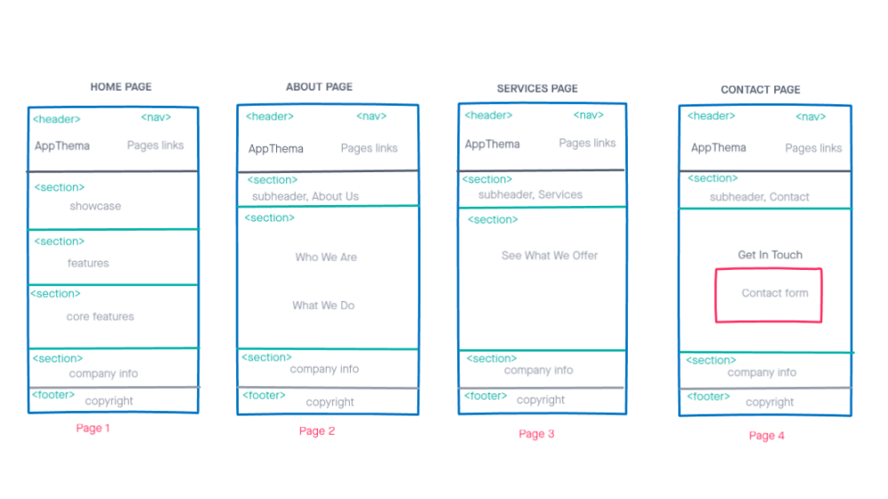

# Development Strategy

> `App-theme`

A fictional web site for HYF students to improve their front-end and Git workflow skills.

## Wireframe

## 0. Set-Up

__A User can see my initial repository and live demo__

### Repo

- Generated as this [starter template](https://github.com/HackYourFutureBelgium/w3-validation-template)
- Clone the repository
- Give a title and description of your project to your README
- Add meta tags ,css file links and title in the head
- Add wireframe
- Push the changes
- Turn on GitHub Pages

## 1.Using Flexbox grid into semantic HTML

__As coaches, we want to see HTML started with semantic elements with flexbox grid built-in classes without using external style(CSS)__

### Repo

This user story was developed on a branch called `semantic-flexbox`

### HTML

- Add semantic elements such as `<header>, <nav>, <section>, <footer>`.
- Add flexbox `row` class which  is a grid-based layout system `one row separated into 12 columns`
- Add flexbox grid class such as `col-xs-12,col-sm-8, col-md-6, col-lg-4` to make web site responsive for different screen sizes.
- Add alignment property `end` for align item into row to start from the end of the row
- Add alignment property `middle`for align item into row  vertically middle
- Add same rules above to `about, services, and contact pages`

### CSS

- Nothing has added  

## 2. Icons and Imgs

__As coaches, we want to see some fancy icons and imgs on the web pages__

### Repo

This user story was developed on a branch called `icon-img`

### HTML

- Add fontawesome icons to all pages company info section
- Add phone img to info core features section
- Change fontawesome links in the head of all pages because  the previous links doesn't apply the fontawesome icons  

### CSS

- Nothing has added  

## 3. Custom CSS for Home Page

__As coaches, we want to see the home page stand out in fancy styling__

### Repo

This user story was developed on a branch called `custom-css-home`

### HTML

- Added `middle-xs middle-sm ...` to header row to align content of row vertically in the middle (all pages).
- fixed `main h1` for sm screen size from `sm-10` to `sm-2` (all pages).
- Added `center-xs` small for header
- Remove `end-xs` for extra small screen, it centered now (all pages)

### CSS

- Gave a `margin auto` to class `container` because the container class does not work as a bootstrap container to center itself.
- Gave img `width 100%`to cover all its columns.
- Gave `font family` as Sans-serif
- Gave `Margin 0` to body it has by default a margin
- Gave `line-height`to give vertically space between lines.
- Gave a `bottom border`to main Header
- Gave a `background` img to showcase and centered it in the middle
- Gave `opacity` to background of showcase content to make it transparency
- Added `@media query` for specific size to show more responsive
- Changed `fontawesome icons` color and size
- Styled the rest`sections and footer` as same styling above

## Finishing Touches

- Write final, complete README:
  - [makeareadme.com](https://www.makeareadme.com/)
  - [bulldogjob](https://bulldogjob.com/news/449-how-to-write-a-good-readme-for-your-github-project)
  - [meakaakka](https://medium.com/@meakaakka/a-beginners-guide-to-writing-a-kickass-readme-7ac01da88ab3)
- Validate code to check for any last mistakes
